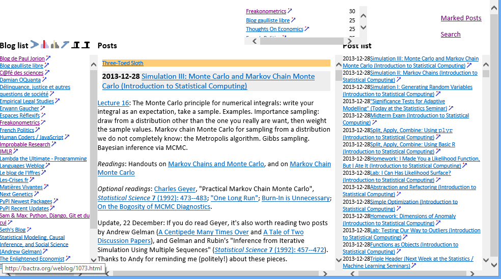
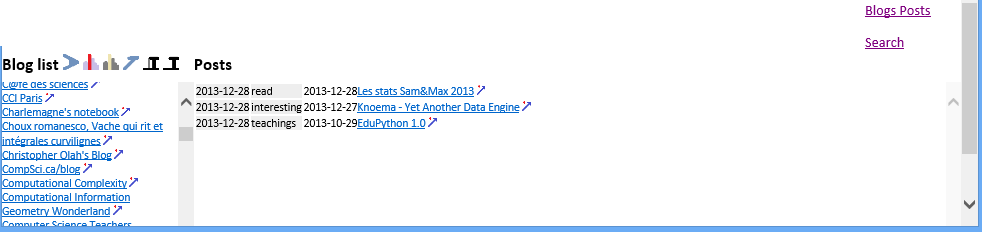
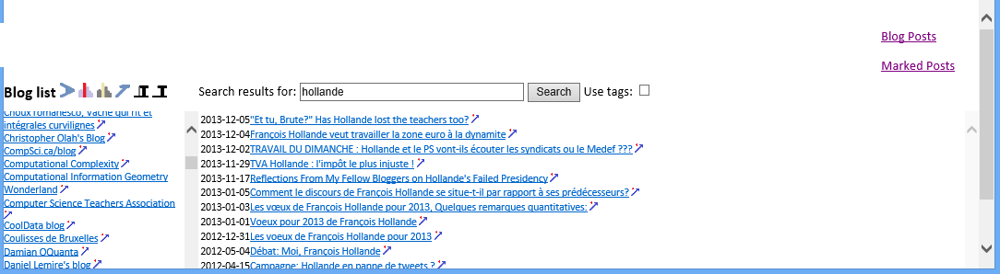

pyrsslocal documentation
========================

**Links:**
    * `pypi/pyrsslocal <https://pypi.python.org/pypi/pyrsslocal/>`_
    * `GitHub/pyrsslocal <https://github.com/sdpython/pyrsslocal/>`_
    * `documentation <http://www.xavierdupre.fr/app/pyrsslocal/helpsphinx/index.html>`_
    * `Windows Setup <http://www.xavierdupre.fr/site2013/index_code.html#pyrsslocal>`_

Description
-----------

This extension proposes a way to download new posts from blogs 
and to navigate through them with a couple of HTML pages
managed by a local python server using a SQLite database:

::

    from pyquickhelper  import fLOG
    from pyrsslocal     import rss_update_run_server
    fLOG (OutputPrint = True)
    xml_blogs = "subscriptions.xml"
    dbfile    = "rss_posts.db3"
    rss_update_run_server(dbfile, xml_blogs)

The previous example takes a dump of blogs url coming from the former Google Reader (see below), 
downloads RSS streams, loads everything into a database (SQLlite format),
and opens a local web application to read them, mark them, or search their titles.
The XML file which describes the blogs looks like this::

    <?xml version="1.0" encoding="UTF-8"?>
    <opml version="1.0">
        <head>
            <title>Xavier subscriptions in Google Reader</title>
        </head>
        <body>
        
            <outline title="new" text="new_">
            
                <!--
                <outline text=""
                    title="" 
                    type="rss"
                    xmlUrl="" 
                    htmlUrl=""/>
                    -->

                <outline text="XD blog" 
                         title="XD blog" 
                         type="rss"
                         xmlUrl="http://www.xavierdupre.fr/blog/xdbrss.xml" 
                         htmlUrl="http://www.xavierdupre.fr/blog/xd_blog.html" />
            </outline>
            
        </body>
    </opml>

You can enumerate the blog posts in the database::

    from pyrsslocal import pyrsslocal
    db = DatabaseRSS(dbfile, LOG = fLOG)
    for blog in db.enumerate_posts() :
        print (blog)
        

Snapshots    
---------

Main page:

Marked blog posts:

Search page:

Functionalities
---------------

* retrieve blog posts and store them into a SQLite database
* Python server accepting python script inside HMTL pages
* run Python script after adding variables to the script context
* download webpage and handle encoding
* javascript files to emphasize python syntax in a HTML page

About this documentation
------------------------

.. toctree::
    :maxdepth: 1

    doctestunit
    generatedoc
    generatesetup
    installation
    all_example
    all_FAQ
    all_notebooks
    glossary
    index_module

    
Indices and tables
==================

+------------------+---------------------+------------------+------------------+------------------------+---------------------+
| :ref:`l-modules` |  :ref:`l-functions` | :ref:`l-classes` | :ref:`l-methods` | :ref:`l-staticmethods` | :ref:`l-properties` |
+------------------+---------------------+------------------+------------------+------------------------+---------------------+
| :ref:`genindex`  |  :ref:`modindex`    | :ref:`search`    | :ref:`l-license` | :ref:`l-changes`       | :ref:`l-README`     |
+------------------+---------------------+------------------+------------------+------------------------+---------------------+
| :ref:`l-example` |  :ref:`l-FAQ`       |                  |                  |                        |                     |
+------------------+---------------------+------------------+------------------+------------------------+---------------------+
   

   

